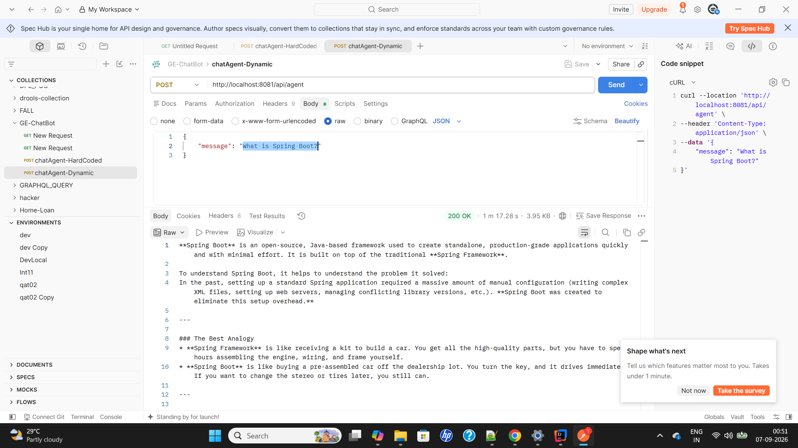

# api-invoke-demo
api-invoke-demo

No Postman? Run this is cmd prompt or terminal:
1) curl -X POST http://localhost:8081/api/chat -H "Content-Type: application/json" -d "{\"message\":\"Hello Backend\"}"
2) curl -X POST http://localhost:8081/api/agent -H "Content-Type: application/json" -d "{\"message\":\"What is Spring Boot?\"}"

